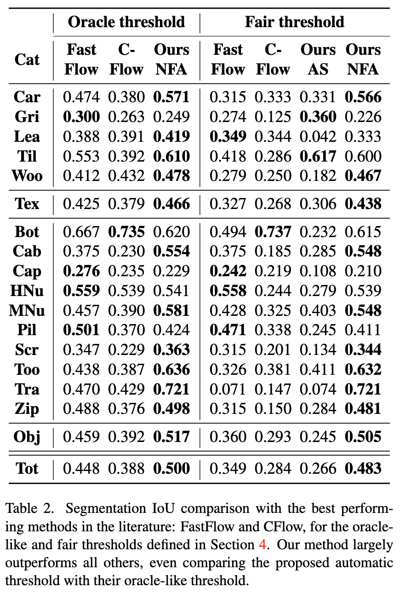

<!-- <div align="center"> -->

<div style="text-align: center;" markdown="1">

# U-Flow: A U-shaped Normalizing Flow for Anomaly Detection with Unsupervised Threshold.

[Link to code](https://www.github.com/mtailanian/uflow)

### Link to download paper:

[](https://arxiv.org/abs/2211.12353)
 
</div>

This is the official code that implements the paper **U-Flow: A U-shaped Normalizing Flow for Anomaly Detection with Unsupervised Threshold.**


## Abstract   

_In this work we propose a non-contrastive method for anomaly detection and segmentation in images, that benefits both from a modern machine learning approach and a more classic statistical detection theory. The method consists of three phases. First, features are extracted by making use of a multi-scale image Transformer architecture. Then, these features are fed into a U-shaped Normalizing Flow that lays the theoretical foundations for the last phase, which computes a pixel-level anomaly map, and performs a segmentation based on the a contrario framework. This multiple hypothesis testing strategy permits to derive a robust automatic detection threshold, which is key in many real-world applications, where an operational point is needed. The segmentation results are evaluated using the Intersection over Union (IoU) metric, and for assessing the generated anomaly maps we report the area under the Receiver Operating Characteristic curve (ROC-AUC) at both image and pixel level. For both metrics, the proposed approach produces state-of-the-art results, ranking first in most MvTec-AD categories, with a mean pixel-level ROC-AUC of 98.74%._ 

### Anomaly localization results (pixel ROC-AUC) over MVTec-AD Dataset


### Segmentation results (IoU) with threshold log(NFA)=0

<div style="text-align: center;" markdown="1">

</div>

 
## Setup

Creating virtual environment and installing dependencies   
```bash
# Create conda virtual environment and activate it
conda create -n uflow python=3.10
conda activate uflow

# Install pytorch with cuda support
conda install -c conda-forge cudatoolkit=11.6
conda install pytorch==1.12.1 torchvision==0.13.1 cudatoolkit=11.6 -c pytorch -c conda-forge

# Install the rest of the dependencies with pip
pip install -r requirements.txt
 ```   

## Download data
To download MvTec AD dataset please enter the root directory and execute the following
```bash
cd <uflow-root>/data
wget https://www.mydrive.ch/shares/38536/3830184030e49fe74747669442f0f282/download/420938113-1629952094/mvtec_anomaly_detection.tar.xz
tar -xvf mvtec_anomaly_detection.tar.xz
rm mvtec_anomaly_detection.tar.xz
```

If you prefer, you can also download each category independently, with the following links:

Texture categories:
[carpet](https://www.mydrive.ch/shares/38536/3830184030e49fe74747669442f0f282/download/420937484-1629951672/carpet.tar.xz), 
[grid](https://www.mydrive.ch/shares/38536/3830184030e49fe74747669442f0f282/download/420937487-1629951814/grid.tar.xz), 
[leather](https://www.mydrive.ch/shares/38536/3830184030e49fe74747669442f0f282/download/420937607-1629951964/leather.tar.xz), 
[tile](https://www.mydrive.ch/shares/38536/3830184030e49fe74747669442f0f282/download/420938133-1629953189/tile.tar.xz), 
[wood](https://www.mydrive.ch/shares/38536/3830184030e49fe74747669442f0f282/download/420938383-1629953354/wood.tar.xz), 

Object categories
[bottle](https://www.mydrive.ch/shares/38536/3830184030e49fe74747669442f0f282/download/420937370-1629951468/bottle.tar.xz), 
[cable](https://www.mydrive.ch/shares/38536/3830184030e49fe74747669442f0f282/download/420937413-1629951498/cable.tar.xz), 
[capsule](https://www.mydrive.ch/shares/38536/3830184030e49fe74747669442f0f282/download/420937454-1629951595/capsule.tar.xz), 
[hazelnut](https://www.mydrive.ch/shares/38536/3830184030e49fe74747669442f0f282/download/420937545-1629951845/hazelnut.tar.xz), 
[metal_nut](https://www.mydrive.ch/shares/38536/3830184030e49fe74747669442f0f282/download/420937637-1629952063/metal_nut.tar.xz), 
[pill](https://www.mydrive.ch/shares/43421/11a215a5749fcfb75e331ddd5f8e43ee/download/420938129-1629953099/pill.tar.xz), 
[screw](https://www.mydrive.ch/shares/38536/3830184030e49fe74747669442f0f282/download/420938130-1629953152/screw.tar.xz), 
[toothbrush](https://www.mydrive.ch/shares/38536/3830184030e49fe74747669442f0f282/download/420938134-1629953256/toothbrush.tar.xz), 
[transistor](https://www.mydrive.ch/shares/38536/3830184030e49fe74747669442f0f282/download/420938166-1629953277/transistor.tar.xz), 
[zipper](https://www.mydrive.ch/shares/38536/3830184030e49fe74747669442f0f282/download/420938385-1629953449/zipper.tar.xz), 

## [Optional] Download pre-trained models

If you are to reproduce the paper results, you could download the pre-trained models that were used to obtain the actual results, or you can even train a model with the provided code (explained in next section).
For downloading the pre-trained models, go to project root directory and execute the `download_models.py` script in the following way:

First, go to the root directory:
```bash
cd <uflow-root>
```

Then execute the following script:

```bash
usage: download_models.py [-h] [-cat CATEGORIES [CATEGORIES ...]] [-overwrite FORCE_OVERWRITE]
```

| **Argument short name** | **Argument long name** |                                                                                 **Description**                                                                                  |                **Default value**                 |
|:-----------------------:|:----------------------:|:--------------------------------------------------------------------------------------------------------------------------------------------------------------------------------:|:------------------------------------------------:|
|          -cat           |      --categories      | MvTec categories to download. None or a subset of [carpet, grid, leather, tile, wood, bottle, cable, capsule, hazelnut, metal_nut, pill, screw, toothbrush, transistor, zipper]. | None: meaning to download all categories at once |
|       -overwrite        |   --force-overwrite    |                              If a certain model is already downloaded, this flag is used to decide whether to download it again anyway or skip it.                               |                      False                       | 


For example, to download all models for only carpet:
```bash
python download_models.py -cat carpet
```

For downloading models for two carpet and grid, and overwrite if already downloaded:
```bash
python download_models.py -cat carpet grid -overwrite true
```

To download all models at once:
```bash
python download_models.py
```

### Troubleshooting
Sometimes, when attempting to download files too frequently, `gdown` gives an error similar to this:

> Access denied with the following error:
> 
>  	Cannot retrieve the public link of the file. You may need to change
> 	the permission to 'Anyone with the link', or have had many accesses.
> 
> You may still be able to access the file from the browser:
> 
> 	 https://drive.google.com/u/1/uc?id=12ZgoyzBWoip1FfmuEiQc0NDweXJr5uNd&export=download

**In that case there are two options: wait a couple of hours (probably 24 hours), or download by hand by entering to [this url](https://drive.google.com/drive/folders/1W1rE0mu4Lv3uWHA5GZigmvVNlBVHqTv_?usp=sharing)**.

If downloading by hand please remember to use the same folder's structure as in Google Drive, inside the `<uflow-root>/models` directory.

## Execution

There are three main files to execute: `train.py`, `predict.py`, and `evaluate.py`.
All scripts are to be run from the root directory `<uflow-root>`.

You might need to add this folder to the pythonpath:
```bash
export PYTHONPATH=$PYTHONPATH:<uflow-root>
```

### Train

For training, the only command line argument required is the category:
```bash
usage: train.py [-h] -cat CATEGORY [-config CONFIG_PATH] [-data DATA] [-train_dir TRAINING_DIR]
```

A basic execution could be for example:
```bash
python src/train.py -cat carpet
```

Command line arguments:

| **Argument short name** | **Argument long name** |                                                                        **Description**                                                                        |                             **Default value**                             |
|:-----------------------:|:----------------------:|:-------------------------------------------------------------------------------------------------------------------------------------------------------------:|:-------------------------------------------------------------------------:|
|          -cat           |       --category       | MvTec category to train. One of [carpet, grid, leather, tile, wood, bottle, cable, capsule, hazelnut, metal_nut, pill, screw, toothbrush, transistor, zipper] |                         None (mandatory argument)                         |
|         -config         |     --config_path      |                                       Config file path. If Not specified, uses the default config in `configs` folder.                                        | None: loads the config in `configs` folder for the corresponding category |
|          -data          |         --data         |                                 Folder with MvTec AD dataset. Inside this folder there must be one folder for each category.                                  |                              uflow-root/data                              |
|       -train_dir        |     --training_dir     |                                                             Folder to save training experiments.                                                              |                            uflow-root/training                            |


The script will generate logs inside `<uflow-root>/training` folder (or a different one if you changed it with the command line arguments), and will log metrics and images to tensorboard.

Tensorboard can be executed as:
```bash
cd <uflow-root>/training
tensorboard --logdir .
```

### Predict
This script performs the inference image by image for the chosen category and displays the results.

```bash
usage: predict.py [-h] -cat CATEGORY [-data DATA]
```

| **Argument short name** | **Argument long name** |                                                                        **Description**                                                                        |   **Default value**   |
|:-----------------------:|:----------------------:|:-------------------------------------------------------------------------------------------------------------------------------------------------------------:|:---------------------:|
|          -cat           |       --category       | MvTec category to train. One of [carpet, grid, leather, tile, wood, bottle, cable, capsule, hazelnut, metal_nut, pill, screw, toothbrush, transistor, zipper] |        carpet         |
|          -data          |         --data         |                                 Folder with MvTec AD dataset. Inside this folder there must be one folder for each category.                                  |    uflow-root/data    |

For example use like this:
```bash
python src/predict.py -cat carpet
```

### Evaluate
This script run the inference and evaluates auroc and segmentation iou, for reproducing results.

```bash
usage: evaluate.py [-h] -cat CATEGORIES [CATEGORIES ...] [-data DATA]
                   [-hp HIGH_PRECISION]
```

| **Argument short name** | **Argument long name** |                                                                            **Description**                                                                            |            **Default value**             |
|:-----------------------:|:----------------------:|:---------------------------------------------------------------------------------------------------------------------------------------------------------------------:|:----------------------------------------:|
|          -cat           |      --categories      | MvTec categories to train. A subset of [carpet, grid, leather, tile, wood, bottle, cable, capsule, hazelnut, metal_nut, pill, screw, toothbrush, transistor, zipper]. | None: meaning to run over all categories |
|          -data          |         --data         |                                     Folder with MvTec AD dataset. Inside this folder there must be one folder for each category.                                      |             uflow-root/data              |
|           -hp           |    --high-precision    |         Whether to use high precision for computing the NFA values or not. High precision acieves slightly better performance but takes more time to execute.         |                  False                   | 

Example usage for two categories:
```bash
python src/evaluate.py -cat carpet grid
```

## A note on sizes at different points

Input
```
- Scale 1: [3, 448, 448]
- Scale 2: [3, 224, 224]
```
MS-Cait outputs
```
- Scale 1: [768, 28, 28]
- Scale 2: [384, 14, 14]
```
Normalizing Flow outputs
```
- Scale 1: [816, 28, 28] --> 816 = 768 + 384 / 2 / 4
- Scale 2: [192, 14, 14] --> 192 = 384 / 2
```

`/ 2` corresponds to the split, and `/ 4` to the invertible upsample.


### Citation

TODO: complete

```
@article{tailanian2022u,
  title={U-Flow: A U-shaped Normalizing Flow for Anomaly Detection with Unsupervised Threshold},
  author={Tailanian, Mat{\'\i}as and Pardo, {\'A}lvaro and Mus{\'e}, Pablo},
  journal={arXiv preprint arXiv:2211.12353},
  year={2022}
}
```

Copyright and License
---------------------

Copyright (c) 2021-2022 Matias Tailanian <mtailanian@gmail.com>

This program is free software: you can redistribute it and/or modify
it under the terms of the GNU Affero General Public License as
published by the Free Software Foundation, either version 3 of the
License, or (at your option) any later version.

This program is distributed in the hope that it will be useful,
but WITHOUT ANY WARRANTY; without even the implied warranty of
MERCHANTABILITY or FITNESS FOR A PARTICULAR PURPOSE.  See the
GNU Affero General Public License for more details.

You should have received a copy of the GNU Affero General Public License
along with this program.  If not, see <http://www.gnu.org/licenses/>.